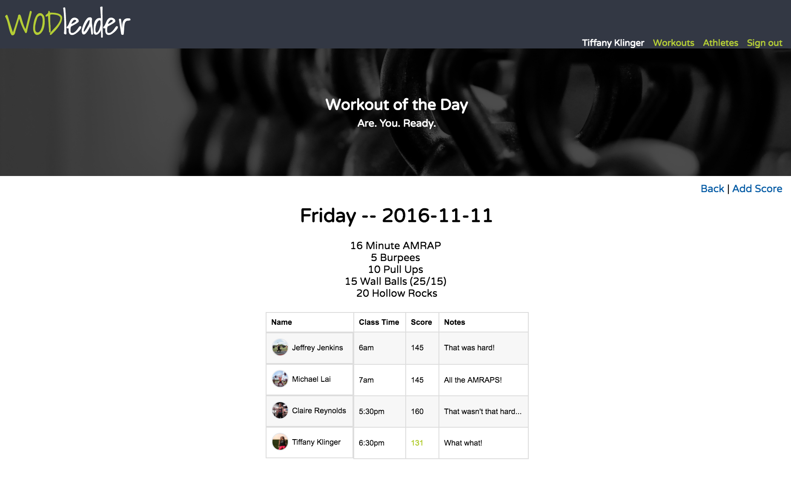

# WODLeader
Are you a fitness junkie? Are you competitive? Are you curious?

WODLeader solves those questions by allowing you to log your exercises and progression all in one app. Athletes both beginners and advanced can navigate simply and seamlessly in the simple user interface.



## Installation

```
git clone git@github.com:MichaelZLai/WODleader.git
gem install
rails s
```

## User Stories

**MVP**
- [x] User Authentication
- [x] CRUD functionality for athlete scores
- [x] Allows CRUD API calls

**Bronze**
- [x] User Authorization (e.g. Coach & Athlete)
- [x] Allow Coach authorization to CRUD Athlete scores and profiles

**Silver**
- [ ] Allow for Mobile responsiveness
- [ ] Ability to add different Gyms
- [ ] Algorithm to determine best performing athlete of the week

**Gold**
- [ ] Allow photo sharing for WOD after effects
- [ ] Compare scores with different Gyms
- [ ] Consolidate monthly scoreboard between athletes


## Technologies


